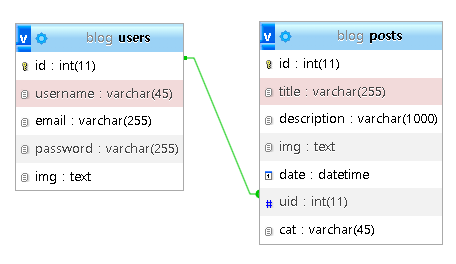

# React Node.js MySQL Full Stack Blog App Tutorial

1. <https://www.youtube.com/watch?v=0aPLk2e2Z3g>

2. 프론트 - React.js

3. 서버 - Express

4. 디비 - MySQL

5. 

## 설치

1. 코드 다운로드 or 레파지토리 클론으로 가져온 뒤에

2. 커맨드 창에서 cd api 입력 -> npm install 입력(node_modules 설치)

3. 커맨드 창에서 cd client 입력 -> npm install 입력(node_modules 설치)

4. phpmyadmin 실행 후에 가져오기를 활용해 blog.sql 실행(mysql 데이터베이스 및 테이블 생성)

5. api 폴더 내에 있는 .env.sample 파일을 이름 바꾸기로 .env로 변경

6. cd api 입력 후 npm start 입력

7. cd client 입력 후 npm start 입력
